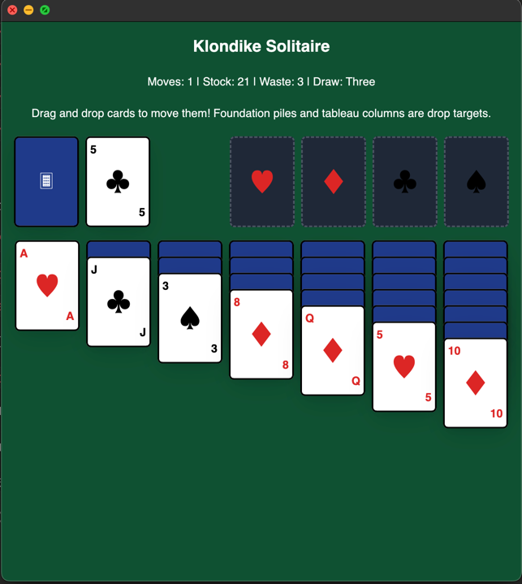

# Solitaire vibe coding session



This repo was started to test out Kiro. I set it a task of coding up Solitaire targeting Zed's UI framework GPUI - a 
challenge as this codebase has little prominence in model weights.

## What I did

* Got Kiro to generate a spec and steering docs.
* Generated MVP business logic and UI using Kiro, accepting mostly as-is to ensure functional progress.
* Some fixes:
    * Kiro invented a hacky drag and drop system instead of:wq relying on GPUI's `on_drag`/`on_drop` mechanism. I used 
      Claude Code to fix this.

## State

The code is in a working state. I'm quite impressed with how far Kiro got even if the generated code is a mess - this is 
such a good way to explore and learn languages and frameworks.

The UI code needs to be knocked into shape by hand before making more progress. Fixes needed:

* Some game state logic is mixed in with the render code, move this to the `game` mod.
* Remove unused/duplicate render codepaths.
* Drop zone styling is messed up - tableau and foundation piles get fully styled instead of appropriate drop zones.
* Drop zone reactivity has been unhooked, reimplement it.
* Card element IDs are strings and constantly being recreated, twice per card per render.
* Study state management - I'm sure it's incorrect.

## Running

```bash
cargo run
```